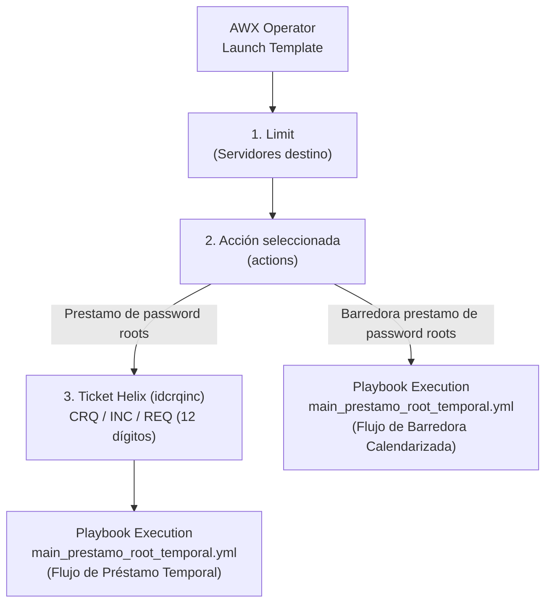
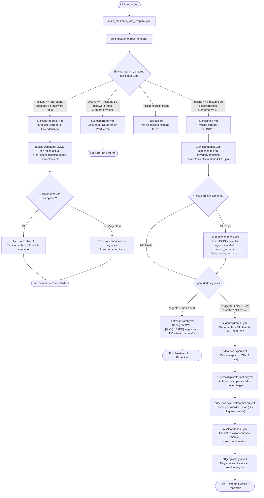
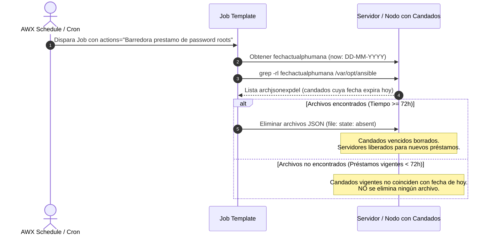

# Company-X-Infraestructure_PASSWORD_ROOT_LEND
## Automatización de Préstamo Temporal de Contraseña de Root (72 Horas)

Este repositorio contiene la solución de automatización en Ansible para la gestión, asignación temporal, expiración controlada de la contraseña del superusuario `root` y mantenimiento automatizado mediante barredora en servidores corporativos multisede y multiplataforma (**Linux / Red Hat / SUSE**, **IBM AIX** y **Oracle Solaris / SunOS**).

---

## Índice
1. [Descripción General](#descripción-general)
2. [Lanzamiento desde Ansible AWX Operator](#lanzamiento-desde-ansible-awx-operator)
3. [Estructura del Proyecto y Roles](#estructura-del-proyecto-y-roles)
4. [Variables por Defecto (`defaults/main.yml`)](#variables-por-defecto-defaultsmainyml)
5. [Flujo y Secuencia de Ejecución Detallada](#flujo-y-secuencia-de-ejecución-detallada)
6. [Mecanismo de Expiración de Contraseña (72 Horas / 3 Días)](#mecanismo-de-expiración-de-contraseña-72-horas--3-días)
7. [Mantenimiento y Barredora de Candados (`s9chkbarradorasu.yml`)](#mantenimiento-y-barredora-de-candados-s9chkbarradorasuyml)
8. [Funcionamiento del Candado (Concurrencia, Bloqueo y Renovación)](#funcionamiento-del-candado-concurrencia-bloqueo-y-renovación)
9. [Auditoría Centralizada y Seguridad](#auditoría-centralizada-y-seguridad)

---

## Descripción General

El objetivo principal de este flujo es otorgar acceso temporal con privilegios de `root` a un grupo determinado de servidores para la atención de incidentes, solicitudes o cambios autorizados (**INC**, **CRQ**, **REQ**), garantizando:
- **Generación de contraseñas seguras y aleatorias:** Complejidad alta de 14 caracteres alfanuméricos y símbolos especiales.
- **Expiración obligatoria del password sin bloqueo de cuenta:** A las **72 horas (3 días)** el sistema operativo exige el cambio o caduca la contraseña temporal, **sin inhabilitar ni bloquear la cuenta `root`**, previniendo interrupciones operativas en servicios del sistema.
- **Control de concurrencia mediante candado (Lockout JSON):** Archivo testigo por host que impide solapamiento de solicitudes activas.
- **Nueva Acción "Barredora prestamo de password roots":** Tarea diseñada para calendarizarse (AWX Schedule) que depura de manera desatendida los archivos de candado cuya fecha de expiración se haya alcanzado (72 horas cumplidas), respetando y preservando intactos aquellos candados que aún estén vigentes.
- **Auditoría centralizada y trazabilidad:** Registro persistente e inmutable en nodo seguro con la identidad del operador de AWX, ID de ticket Helix, host, contraseña y fecha límite.
- **Protección estricta de entornos:** Bloqueo automático para ejecuciones en entornos productivos (`PR`), permitiendo únicamente entornos de prueba/entrega (`EP`).

---

## Lanzamiento desde Ansible AWX Operator

La ejecución del proceso se orquesta desde **Ansible AWX Operator** mediante la plantilla de trabajo (**Job Template**):

* **Nombre de la Plantilla:** `Template_Company-X-Infraestructure_PASSWORD_ROOT_LEND`
* **Playbook maestro ejecutado:** [main_prestamo_root_temporal.yml](file:///run/media/juhoc/1840688727576A58/Documents/GitHubPersonal/Company-X-Infraestructure_PASSWORD_ROOT_LEND/main_prestamo_root_temporal.yml)

### Parámetros solicitados en la Encuesta (Prompt / Survey):



1. **Limit (Servidores destino):**
   Filtro de inventario donde se aplicará la plantilla. Admite expresiones regulares o listas separadas por comas/espacios:
   ```text
   lcdasb4gmx01.* lcdasb4gmx02.* lcdasb4gmx03.*
   ```
2. **Ticket o ID Helix (`idcrqinc`):**
   Identificador del cambio o ticket de soporte (requerido para la acción de préstamo). Se valida estrictamente mediante expresión regular:
   - Debe iniciar con el prefijo `CRQ`, `INC` o `REQ`.
   - Seguido de exactamente 12 dígitos numéricos.
   - *Ejemplos válidos:* `CRQ000012345678`, `REQ000098765432`, `INC000055443322`.
3. **Acciones (`actions`):**
   Menú desplegable con dos opciones operativas:
   - `Prestamo de password roots`: Ejecuta la validación del ticket Helix, evaluación del candado, generación de la clave aleatoria, asignación de credenciales, configuración de caducidad de password a 72 horas (sin bloqueo de cuenta), creación del candado JSON y registro en bitácora centralizada.
   - `Barredora prestamo de password roots`: Acción de mantenimiento diseñada para calendarizarse periódicamente (AWX Schedules) o lanzarse bajo demanda. Busca y elimina los archivos JSON de candado cuya fecha de expiración coincide con la fecha actual (72 horas ya transcurridas), dejando el servidor libre para futuros préstamos. Si la fecha aún está vigente, no borra ningún archivo.

---

## Estructura del Proyecto y Roles

```text
/Company-X-Infraestructure_PASSWORD_ROOT_LEND/
├── README.md                                 # Documentación técnica integral
├── main_prestamo_root_temporal.yml           # Playbook maestro de entrada
└── roles/
    └── role_prestamo_root_temporal/          # Rol principal de préstamo y mantenimiento
        ├── defaults/
        │   └── main.yml                      # Definición de variables globales por defecto
        ├── tasks/
        │   ├── main.yml                      # Orquestador del flujo y enrutador por acción/entorno
        │   ├── s0chkidhelix.yml              # Validación de formato del ticket Helix (CRQ/INC/REQ)
        │   ├── s1chkcandadosu.yml            # Comprobación de existencia de candado y orquestación
        │   ├── s2readcandadosu.yml           # Lectura y cálculo de vigencia del candado JSON
        │   ├── s3genpwdrdmsu.yml             # Generación de contraseña aleatoria y hash SHA-512
        │   ├── s4calpwdexpsu.yml             # Cálculo de fechas de expiración multiplataforma (72h / 3d)
        │   ├── s5setpwdlinuxsu.yml           # Asignación de contraseña a root en Linux
        │   ├── s5setpwdaixsu.yml             # Asignación de contraseña a root en AIX
        │   ├── s5setpwdsunossu.yml           # Asignación de contraseña a root en Solaris (SunOS)
        │   ├── s6setpwdexplinuxsu.yml        # Expiración de contraseña en Linux (3 días, sin bloqueo de cuenta)
        │   ├── s6setpwdexpaixsu.yml          # Expiración de contraseña en AIX (maxage=3, sin bloqueo de cuenta)
        │   ├── s6setpwdexpsunossu.yml        # Expiración de contraseña en Solaris (passwd -x 3, sin bloqueo de cuenta)
        │   ├── s7setcandadosu.yml            # Creación/actualización del archivo candado JSON
        │   ├── s8genpwdlogsu.yml             # Auditoría centralizada en servidor seguro
        │   ├── s9chkbarradorasu.yml          # Barredora: eliminación de candados cumplidos (>= 72h)
        │   ├── s98msgerramb.yml              # Manejo de error: Entorno de producción (PR) bloqueado
        │   └── s99msgerramb.yml              # Notificación de préstamo activo y bloqueo de sobreescritura
        ├── vars/
        │   └── main.yml
        ├── files/
        │   └── main.yml
        └── templates/
            └── main.yml
```

---

## Variables por Defecto (`defaults/main.yml`)

El archivo [defaults/main.yml](file:///run/media/juhoc/1840688727576A58/Documents/GitHubPersonal/Company-X-Infraestructure_PASSWORD_ROOT_LEND/roles/role_prestamo_root_temporal/defaults/main.yml) centraliza los parámetros operativos del rol:

| Variable | Valor / Expresión por Defecto | Descripción |
|---|---|---|
| `fechahoraactual` | `{{ now(fmt='%d-%m-%Y %H:%M:%S') }}` | Timestamp del momento de ejecución para bitácora y auditoría. |
| `nombreservidor` | `{{ inventory_hostname.split('.')[0] }}` | Nombre corto del host (hostname). |
| `direccionip` | `{{ hostvars[inventory_hostname]['ipaddress'] }}` | Dirección IP del host provista por el inventario de AWX. |
| `grado` | `{{ hostvars[inventory_hostname]['tier'] }}` | Nivel / Tier de criticidad del servidor. |
| `entorno` | `{{ hostvars[inventory_hostname]['entorno'] }}` | Entorno del servidor (`EP` = Entrega/Pruebas, `PR` = Producción). |
| `plataforma` | `{{ ansible_system \| lower }}` | Kernel detectado: `linux`, `aix` o `sunos`. |
| `sistemaos` | `{{ ansible_os_family \| lower }}` | Familia de sistema operativo (`redhat`, `suse`, `aix`, `solaris`). |
| `sistemaosv` | `{{ ansible_distribution_major_version }}` | Versión mayor del OS. |
| `sistemaosvaix` | `{{ ansible_distribution_version.split('.')[0:2] \| join('.') }}` | Versión de dos niveles para AIX. |
| `directoriologs` | `/var/opt/ansible` | Ruta base de auditoría y almacenamiento de candados. |
| `directoriocandado` | `{{ directoriologs }}/candado` | Directorio donde residen los archivos de candado JSON (`/var/opt/ansible/candado`). |
| `servidorseguro` | `lcmasb4gmx99.bvm.bluecare.kyndryl.net` | Nodo de seguridad central donde se asienta la bitácora de auditoría. |
| `servidorautomation` | `lcmasb4gmx100.bvm.bluecare.kyndryl.net` | Nodo de control/automatización donde residen los candados y se generan las claves. |
| `superuser` | `root` | Cuenta a intervenir. |
| `clavealeatoria` | `</dev/urandom tr -dc 'A-Za-z0-9!@#$%^&*()' \| head -c 14; echo` | Generador shell de contraseñas de alta entropía (14 caracteres). |
| `tipoexpiracion` | `horas` | Unidad de medida temporal de cálculo. |
| `tiempoexpiracionhrs` | `72` | Duración del préstamo en horas (**72 horas**). |
| `tiempoexpiraciondia` | `3` | Duración del préstamo en días (**3 días**), aplicado a expiración de password en OS. |

---

## Flujo y Secuencia de Ejecución Detallada



### Paso a Paso de las Tareas:

1. **`tasks/main.yml` (Enrutamiento por Acción y Entorno):**
   - Evalúa `actions` y el entorno:
     - Si `actions == 'Prestamo de password roots'` y el sistema operativo está soportado (`redhat`, `suse`, `aix`, `solaris`):
       - En `entorno == 'EP'`: enruta a `['s0chkidhelix', 's1chkcandadosu']`.
       - En `entorno == 'PR'`: enruta a `['s98msgerramb']` impidiendo cualquier cambio en servidores productivos.
     - Si `actions == 'Barredora prestamo de password roots'`: enruta a `['s9chkbarradorasu']`.
     - Si la opción no es válida: asigna `['No selecciono ninguna tarea', 'No_selecciono_ninguna_tarea']`.
   - Ejecuta un `assert` en `localhost` con `run_once: true` para verificar que la selección sea válida.
   - Ejecuta el bucle de tareas resultante en `runplaybook`.

2. **`tasks/s0chkidhelix.yml` (Validación de Ticket Helix):**
   - Se ejecuta una sola vez (`run_once: true`) delegado a `servidorautomation`.
   - Limpia espacios del ticket (`idcrqinc | trim`).
   - Valida mediante expresión regular que cumpla el patrón `(CRQ|INC|REQ)[0-9]{12}`. Si no cumple, aborta la ejecución inmediatamente.

3. **`tasks/s1chkcandadosu.yml` (Orquestación del Candado y Evaluación de Préstamo):**
   - Realiza un `stat` en `servidorautomation` sobre `/var/opt/ansible/candado/{{ nombreservidor }}.json`.
   - Si el archivo existe, incluye **`s2readcandadosu.yml`** para leer los datos y determinar si el candado sigue vigente (`epoch_actual < fecha_expiracion_epoch`).
   - Evalúa la condición:
     - Si **no existe** el archivo candado, o si **ya no está vigente** (`not vigenciacandado`): asigna la lista de tareas de aprovisionamiento: `['s3genpwdrdmsu', 's4calpwdexpsu', 's5setpwd<plataforma>su', 's6setpwdexp<plataforma>su', 's7setcandadosu', 's8genpwdlogsu']`.
     - Si el archivo **sí existe y está vigente**: asigna `['s99msgerramb']` para notificar en AWX y proteger el préstamo en curso sin alterar credenciales.

---

## Mecanismo de Expiración de Contraseña (72 Horas / 3 Días)

> [!IMPORTANT]
> **Cambio de Enfoque Operativo:**
> Anteriormente, el flujo configuraba la expiración de la cuenta de usuario `root` (`expires`), lo que provocaba que al cumplirse las 72 horas la cuenta quedara **bloqueada/inhabilitada en el sistema operativo**, impidiendo cualquier inicio de sesión o elevación de privilegios hasta su desbloqueo.
>
> **Enfoque Actual:** Ahora el flujo **expira exclusivamente la contraseña** de `root` a los **3 días (72 horas)** sin bloquear la cuenta (`expires: -1`), garantizando que los servicios del sistema y la operatividad del host permanezcan intactos.

Cuando un servidor califica para un préstamo o renovación:

### 1. Generación de Contraseña (`s3genpwdrdmsu.yml`):
- Delegado al nodo de automatización (`servidorautomation`) con `run_once: true`.
- Genera una contraseña unificada de 14 caracteres aleatorios:
  ```bash
  /dev/urandom tr -dc 'A-Za-z0-9!@#$%^&*()' | head -c 14; echo
  ```
- Genera dos variables de hecho (facts):
  - `claveplana`: Contraseña en texto claro.
  - `clavecifrada`: Hash criptográfico SHA-512 obtenido mediante el filtro `password_hash('sha512')`.

### 2. Cálculo de Tiempos y Formatos de Expiración (`s4calpwdexpsu.yml`):
Calcula `tiempoexpiracionhrs: 72` a partir de `ansible_date_time.epoch`:
- **Humano / Auditoría (`fechaexphumana`):** Formato `%d-%m-%Y %H:%M:%S` (ejemplo: `30-09-2026 19:39:26`).
- **Linux (`fechaexplinux`):** Timestamp en segundos epoch.
- **IBM AIX (`fechaexpaix`):** Formato fecha/hora `%m%d%H%M%y`.
- **Oracle Solaris (`fechaexpsolaris`):** Formato fecha ISO `%Y-%m-%d`.

### 3. Aplicación del Password según Plataforma (`s5setpwd<plataforma>su.yml`):
- **Linux (`s5setpwdlinuxsu.yml`):**
  Aplica el hash SHA-512 con el módulo nativo `ansible.builtin.user`:
  ```yaml
  user:
    name: "root"
    password: "{{ clavecifrada }}"
    update_password: always
  ```
- **IBM AIX (`s5setpwdaixsu.yml`):**
  Actualiza la contraseña mediante el comando `chpasswd`:
  ```bash
  echo "root:{{ claveplana }}" | chpasswd -c
  ```
- **Oracle Solaris / SunOS (`s5setpwdsunossu.yml`):**
  Actualiza las credenciales en Solaris con `usermod`:
  ```bash
  usermod -p "{{ clavecifrada }}" root
  ```

### 4. Configuración de Expiración de Password SIN Bloqueo de Cuenta (`s6setpwdexp<plataforma>su.yml`):
- **Linux (`s6setpwdexplinuxsu.yml`):**
  Configura `password_expire_max` a 3 días y remueve cualquier expiración/bloqueo de cuenta (`expires: -1`):
  ```yaml
  user:
    name: "{{ superuser }}"
    password_expire_max: "{{ tiempoexpiraciondia }}" # 3 días (72 hrs)
    expires: -1 # Remueve el bloqueo de cuenta
  ```
- **IBM AIX (`s6setpwdexpaixsu.yml`):**
  Aplica `maxage` en el atributo de usuario para forzar la expiración de la clave sin bloquear la cuenta:
  ```bash
  chuser maxage={{ tiempoexpiraciondia }} {{ superuser }}
  ```
- **Oracle Solaris / SunOS (`s6setpwdexpsunossu.yml`):**
  Define la antigüedad máxima de la contraseña en `/etc/shadow` con `passwd -x`:
  ```bash
  passwd -x {{ tiempoexpiraciondia }} {{ superuser }}
  ```

### 5. Creación del Archivo Candado (`s7setcandadosu.yml`):
Guarda en `servidorautomation` el archivo `/var/opt/ansible/candado/{{ nombreservidor }}.json`:
```json
{
  "host": "lcdasb4gmx01",
  "IP": "10.x.x.x",
  "usuario_solicitante": "usuario@company-x.ldn",
  "idhelix": "CRQ000012345678",
  "fecha_prestamo": "2026-09-27T19:39:26Z",
  "fecha_expiracion_humana": "30-09-2026 19:39:26",
  "fecha_expiracion_epoch": 1790797166,
  "claveplana": "0NIZQMdZUpD4iO"
}
```

### 6. Registro de Auditoría Central (`s8genpwdlogsu.yml`):
Asienta la entrega de clave en `servidorseguro` (`lcmasb4gmx99...`) en `/var/opt/ansible/prestamoroot-YYYY-MM-DD.log` con permisos `0600` y `throttle: 1`.

---

## Mantenimiento y Barredora de Candados (`s9chkbarradorasu.yml`)

La acción **"Barredora prestamo de password roots"** proporciona un mecanismo automatizado de depuración y limpieza de candados vencidos para su ejecución programada (**AWX Schedule**).



### Lógica de Operación:
1. **Detección de Fecha Actual:**
   Obtiene la fecha del sistema en formato de día: `fechactualphumana: "{{ now(fmt='%d-%m-%Y') }}"`.
2. **Búsqueda por Coincidencia de Expiración:**
   Ejecuta:
   ```bash
   grep -rl {{ fechactualphumana }} /var/opt/ansible
   ```
   Debido a que cada archivo JSON almacena `"fecha_expiracion_humana": "DD-MM-YYYY HH:MM:SS"` calculada exactamente a las 72 horas del préstamo, el comando localiza únicamente aquellos candados cuya fecha de vencimiento corresponde al día de ejecución.
3. **Depuración Segura:**
   - **Candados Cumplidos (= 72 horas):** Se registran en `archjsonexpdel`, se imprimen en el log de AWX y se eliminan mediante `ansible.builtin.file: state: absent`.
   - **Candados Vigentes (< 72 horas):** Tienen una fecha de expiración futura que no coincide con la fecha de hoy; por tanto, el comando no los retorna y **no se elimina ningún archivo**, conservando intacto el candado activo.
4. **Calendarización Recomendada:**
   Se recomienda configurar un **Schedule** diario en Ansible AWX Operator (por ejemplo, a las `00:05` o en ventanas programadas) ejecutando la plantilla con la acción `Barredora prestamo de password roots`.

---

## Funcionamiento del Candado (Concurrencia, Bloqueo y Renovación)

El candado previene colisiones operativas entre diferentes administradores y asegura que un servidor no sea modificado mientras un préstamo esté en curso:

| Escenario | Estado del Archivo JSON | Vigencia Temporal | Acción Ejecutada | Resultado Operativo |
|---|---|---|---|---|
| **1. Primer Préstamo** | No existe (`stat.exists = false`) | No aplica | `['s3', 's4', 's5', 's6', 's7', 's8']` | Genera clave, aplica expiración de password a 3 días (cuenta activa), crea JSON y registra auditoría. |
| **2. Préstamo Activo** | Existe (`stat.exists = true`) | **`True`** (`epoch < exp_epoch`) | `['s99msgerramb']` | Muestra en consola AWX `[BLOQUEADO] <host> ya esta prestado a ... hasta ...`. **NO altera el servidor ni cambia contraseñas**. |
| **3. Ejecución de Barredora** | Existe (`stat.exists = true`) | **`False`** (expiración = fecha actual) | `['s9chkbarradorasu']` | **Elimina el archivo JSON del candado**, dejando el host disponible para un próximo ciclo de préstamo. |
| **4. Renovación Directa** | Existe (`stat.exists = true`) | **`False`** (`epoch >= exp_epoch`) | `['s3', 's4', 's5', 's6', 's7', 's8']` | Si no se ha corrido la barredora pero expiró el tiempo, genera nueva clave, actualiza el JSON y renueva el ciclo por 72h. |

---

## Auditoría Centralizada y Seguridad

Cada otorgamiento o renovación de contraseña asienta un registro inmutable en `servidorseguro` (`lcmasb4gmx99.bvm.bluecare.kyndryl.net`) dentro del archivo `/var/opt/ansible/prestamoroot-YYYY-MM-DD.log`:

```text
ID_Helix: CRQ000012345678,Usuario_solicitante: usuario@company-x.ldn,Fecha_Aplicacion: 27-09-2026 19:39:26,Host: lcdasb4gmx01,Password: 0NIZQMdZUpD4iO,Expira_password_root: 30-09-2026 19:39:26
```

- **Permisos Restringidos:** Archivo creado con permisos `0600` (legible y modificable únicamente por root en el nodo seguro).
- **Serialización (`throttle: 1`):** Evita condiciones de carrera en ejecuciones concurrentes de AWX.
- **Ocultamiento de Credenciales (`no_log: true`):** Protege la salida de tareas críticas (`s2`, `s5`) en la consola web de AWX.
